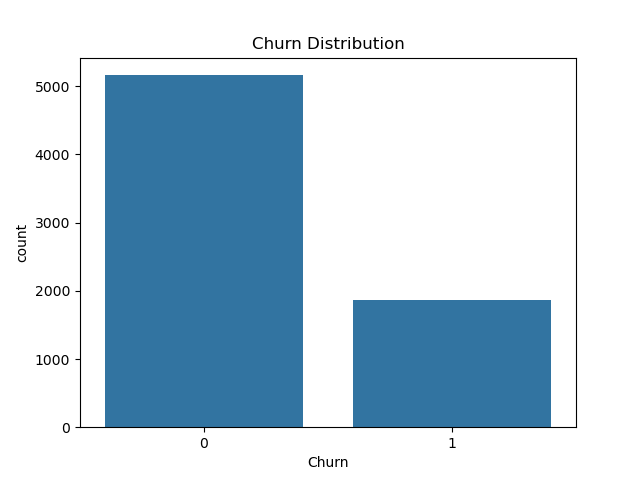
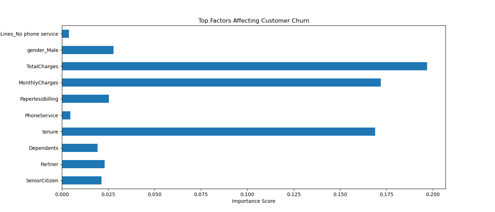

# Customer Churn Prediction using Machine Learning

## Project Overview

Customer churn is a major problem in the telecom industry. This project uses Machine Learning techniques to predict whether a customer will leave the telecom service based on demographic information, account details, and service usage.

The goal is to help telecom companies identify customers at risk of churn and take preventive actions.

---

## Dataset

The dataset contains **7043 customer records** with **21 features** including:

- Customer demographics
- Service subscriptions
- Billing information
- Contract type
- Internet services

### Target Variable

**Churn**

- 1 → Customer leaves the service
- 0 → Customer stays

---

## Project Workflow

### 1. Data Cleaning

- Removed unnecessary columns (`customerID`)
- Converted categorical variables to numeric
- Applied one-hot encoding for categorical features

---

### 2. Exploratory Data Analysis (EDA)

Explored customer churn patterns using visualizations.

#### Key Observations

- Customers with **higher monthly charges** churn more.
- Customers with **short tenure** have higher churn rates.
- **Month-to-month contracts** show higher churn.

---

### 3. Feature Engineering

- Converted categorical variables using `pd.get_dummies()`
- Prepared feature matrix for machine learning models.

---

### 4. Model Building

Two models were trained:

- Logistic Regression
- Random Forest Classifier

---

### 5. Model Evaluation

Accuracy Achieved:

- Logistic Regression: **~78%**
- Random Forest: **~78%**

#### Confusion Matrix

Confusion matrix and classification metrics were used to evaluate model performance.

---

## Feature Importance

Top features affecting churn:

Key churn drivers:

- Total Charges
- Monthly Charges
- Tenure
- Paperless Billing

These features play a major role in predicting whether a customer will churn.

---

## Business Insights

From the analysis:

- Customers with **high monthly charges** are more likely to churn.
- Customers with **short tenure** leave more frequently.
- Customers on **month-to-month contracts** have higher churn risk.

---

## Business Recommendations

Telecom companies can reduce churn by:

- Offering discounts for customers with high monthly charges
- Providing loyalty benefits for new customers
- Encouraging long-term contract plans

---

## Technologies Used

- Python
- Pandas
- NumPy
- Matplotlib
- Seaborn
- Scikit-learn
- Jupyter Notebook

---
